  

###

# คู่มือการทดสอบ Mini App บน Android  ผ่าน App Tester

[App Tester คืออะไร](#app-tester-คืออะไร)  
[ลงทะเบียน App Tester กับทาง DGA](#ลงทะเบียน-app-tester-กับทาง-dga)  
[ขั้นตอนการติดตั้ง App Tester](#ขั้นตอนการติดตั้ง-app-tester)  
[ขั้นตอนการติดตั้ง ทางรัฐ จาก App Tester](#ขั้นตอนการติดตั้ง-ทางรัฐ-จาก-app-tester)  

###

## App Tester คืออะไร

`App Tester` คือแอปพลิเคชันใน Android ที่ช่วยให้นักพัฒนาติดตั้งและเข้าถึงแอปทดสอบทั้งหมดได้ในที่เดียว เพื่อให้นักพัฒนาได้ทดสอบ ก่อนปล่อยเข้าสู่กระบวนการ Production ต่อไป
โดยสิ่งที่จะได้จากการดาวน์โหลด `ทางรัฐ` จาก App Tester คือ จะสามารถใช้ `ทางรัฐ` บน Environment ทดสอบ เพื่อใช้เข้าถึง `Miniapp` ที่อยู่ในขั้นตอนการพัฒนา ได้

## ลงทะเบียน App Tester กับทาง DGA

ℹ️ ข้อมูลที่ต้องใช้สำหรับลงทะเบียน App Tester

1.  ชื่อ - นามสกุล ภาษาอังกฤษ  
2.  ชื่อหน่วยงาน หรือ ชื่อบริษัท ภาษาอังกฤษ  
3.  email ที่เป็น Google Account  

## ขั้นตอนการติดตั้ง App Tester

1. เมื่อ `ลงทะเบียน App Tester กับทาง DGA` แล้ว จะได้รับคำเชิญผ่านทางอีเมลที่ระบุ กรุณาตรวจสอบอีเมล และเริ่มเป็นผู้ทดสอบ โดยกดปุ่ม `Get Started`  
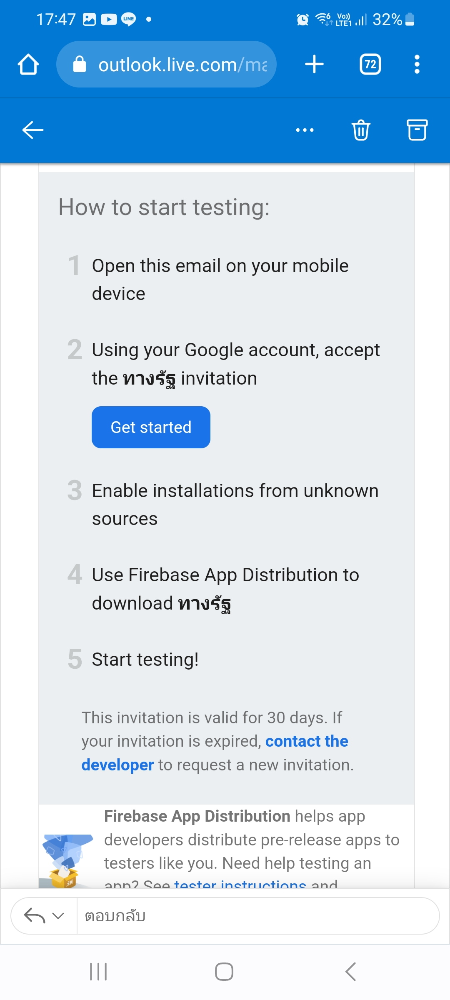

###

2. เริ่มต้นเป็นผู้ทดสอบด้วยการตอบรับคำเชิญ โดยกดปุ่ม `ตอบรับคำเชิญ`  
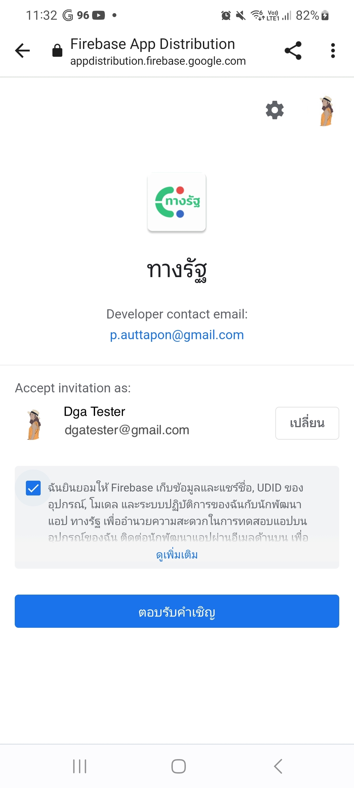  

###

3. กดปุ่ม `ดาวน์โหลด App Tester` เพื่อดาวน์โหลด App Tester  
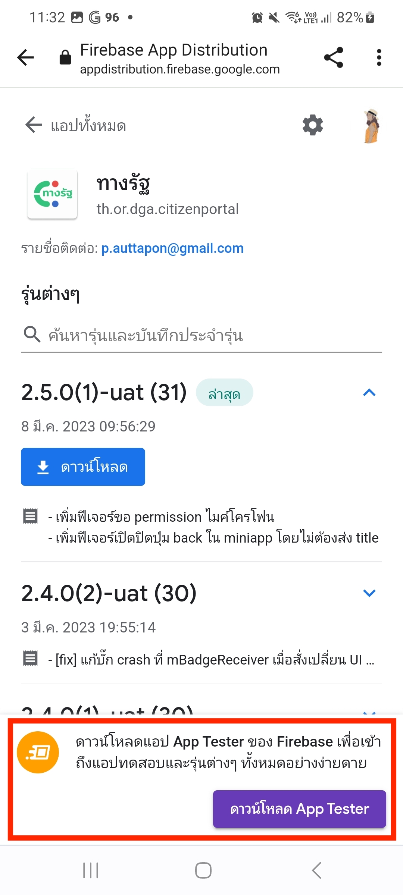  

###

4. เปิดไฟล์ที่ดาวน์โหลดและกดปุ่ม `ติดตั้ง`  
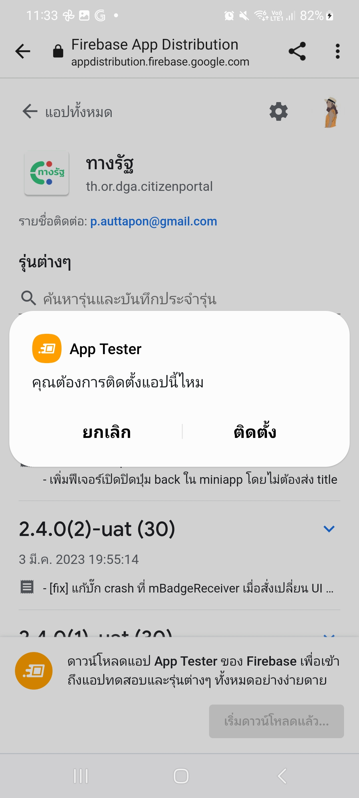

###

5. อนุญาตให้ติดตั้ง App Tester จากแหล่งที่ไม่รู้จัก โดยกดปุ่ม `การตั้งค่า`  
  

###

6. เปิดการใช้งานสำหรับการติดตั้ง `App Tester` จากแอปพลิเคชัน `Chrome` และกดปุ่ม `ติดตั้ง`  
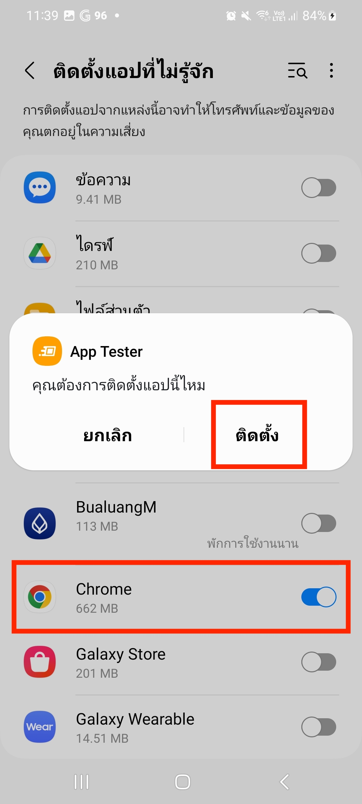

###

## ขั้นตอนการติดตั้ง ทางรัฐ จาก App Tester

1. เปิด `App Tester` และลงชื่อเข้าใช้ด้วย `Google Account` โดยกดปุ่ม `Sign in with Google`  
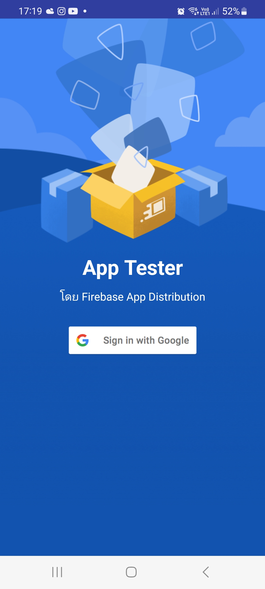

###

2. เมื่อลงชื่อเข้าใช้สำเร็จ ในหน้าแรกของ App Tester จะแสดงแอปพลิเคชันให้เลือก กดเลือกแอป `ทางรัฐ`  
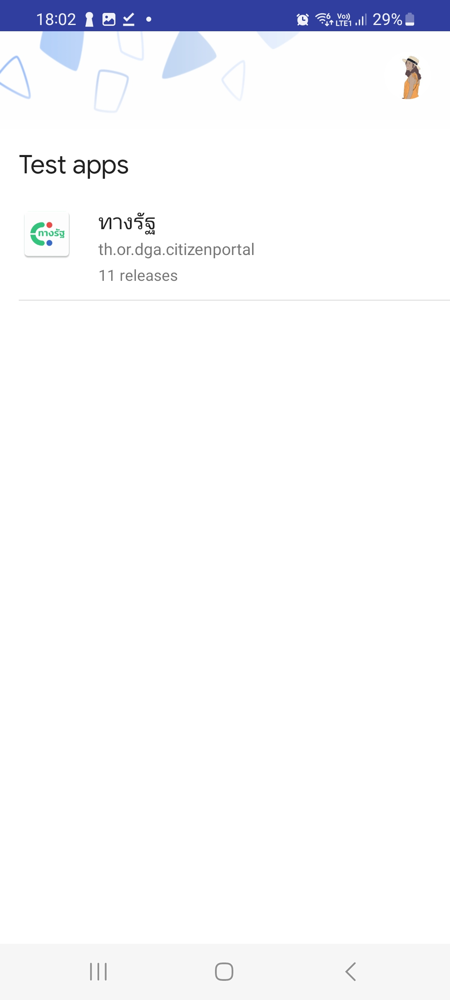

###

3. กดยินยอมให้ Firebase เก็บข้อมูลฯ และกดปุ่ม `เริ่มทดสอบบนอุปกรณ์นี้`  
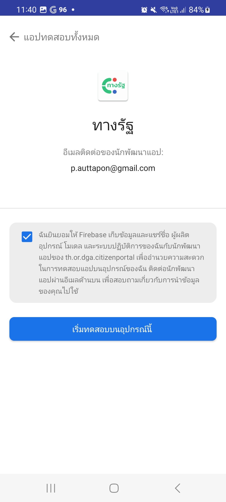

###

4. ในหน้าแสดงแอปทดสอบทั้งหมด เลือกเวอร์ชันแอปที่ต้องการติดตั้งแล้วกดปุ่ม `ดาวน์โหลด` แอปที่ติดตั้งผ่าน App Tester จะเพิ่มไปยังหน้าจอหลักของอุปกรณ์โดยอัตโนมัติ  
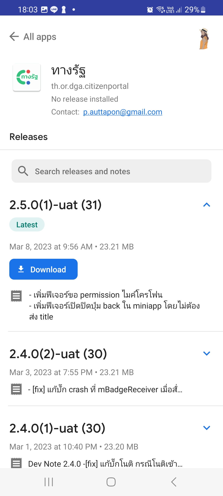

###

5. อนุญาตการติดตั้ง `ทางรัฐ` จาก `App Tester` โดยกดปุ่ม `การตั้งค่า`  
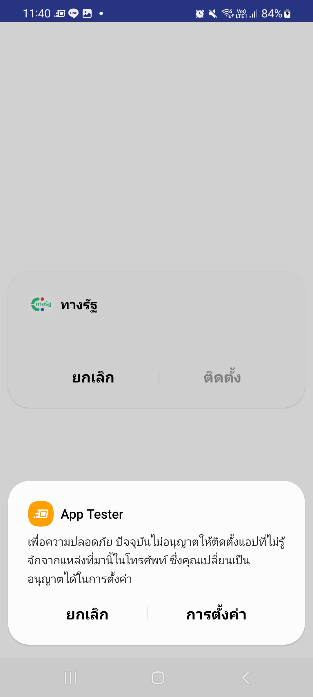  

###

6. เปิดการใช้งานสำหรับการติดตั้ง `ทางรัฐ` จากแอปพลิเคชัน `App Tester` และกดปุ่ม `ติดตั้ง` เพื่อติดตั้งแอปพลิเคชัน ทางรัฐ  
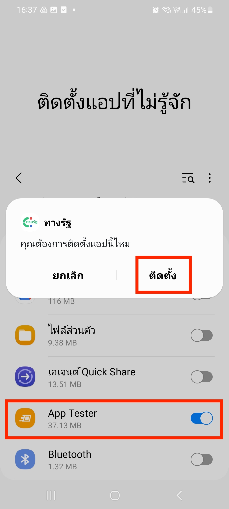 

###

* * *

