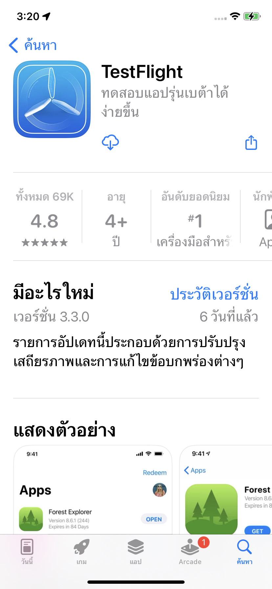
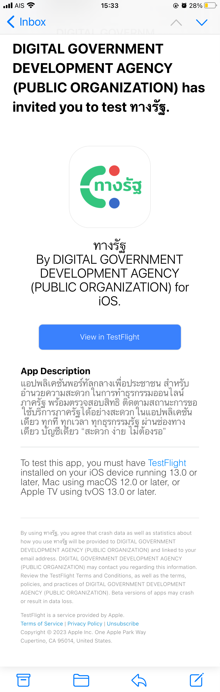
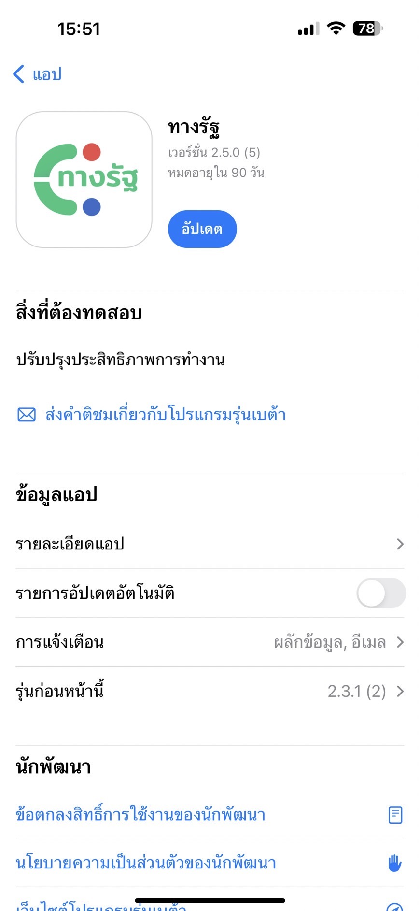
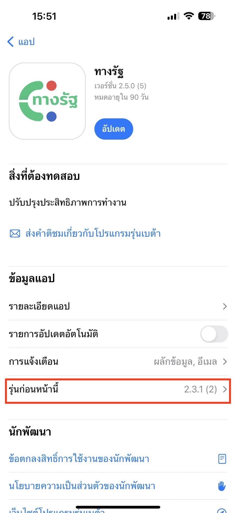

  

###

# คู่มือการทดสอบ Mini App บน iOS ผ่าน TestFlight

[TestFlight คืออะไร](#testflight-คืออะไร)  
[ลงทะเบียน TestFlight กับทาง DGA](#ลงทะเบียน-testflight-กับทาง-dga)  
[ขั้นตอนการติดตั้ง ทางรัฐ จาก TestFlight](#ขั้นตอนการติดตั้ง-ทางรัฐ-จาก-testflight)  
[ขั้นตอนการติดตั้ง ทางรัฐ Version อื่นๆ](#ขั้นตอนการติดตั้ง-ทางรัฐ-version-อื่นๆ)  

###

## TestFlight คืออะไร

`TestFlight` คือ Application ใน iOS สำหรับ Download Application ใน Version พัฒนา สำหรับให้นักพัฒนาได้ทดสอบ ก่อนปล่อยเข้าสู่กระบวนการ Production ต่อไป
โดยสิ่งที่จะได้จากการ Download `App ทางรัฐ` จาก TestFlight คือ จะสามารถใช้ App ทางรัฐ บน Environment ทดสอบ เพื่อใช้เข้าถึงบริการ `Miniapp` ที่อยู่ในขั้นตอนการพัฒนา ได้

###

## ลงทะเบียน TestFlight กับทาง DGA

ท่านที่ต้องการทดสอบ App ทางรัฐ สำหรับพัฒนาบริการ (miniApp) สามารถติดต่อทางเจ้าหน้าที่ DGA พร้อมทั้งส่งข้อมูลดังนี้

ℹ️ ข้อมูลที่ต้องใช้สำหรับลงทะเบียน TestFlight

1.  ชื่อ - นามสกุล ภาษาอังกฤษ  
2.  ชื่อหน่วยงาน หรือ ชื่อบริษัท ภาษาอังกฤษ  
3.  email ที่เป็น AppleID  

###

## ขั้นตอนการติดตั้ง ทางรัฐ จาก TestFlight

1. Download และติดตั้ง `TestFlight` จาก AppStore  
  

###

2. ทำการ Login TestFlight ด้วย email AppleID เดียวกับที่ได้ให้ไว้กับ DGA  

###

3. ตรวจสอบ email ที่ได้ให้ไว้กับ DGA แล้วกดปุ่ม `View in TestFlight` เพื่อ Activate TestFlight  
  

###

4.  Download และติดตั้ง `ทางรัฐ` ได้จาก TestFlight  
  

## ขั้นตอนการติดตั้ง ทางรัฐ Version อื่นๆ  

หากต้องการ Download Version อื่นๆ สามารถทำได้ดังนี้

1.  เข้าไปที่ App ทางรัฐ ใน TestFlight  

2.  เลื่อนไปที่ `ข้อมูลแอป` แล้วเลือก `รุ่นก่อนหน้านี้` หรือ กรณีภาษาอังกฤษ ไปที่ `App Information` แล้วเลือก `Previous Builds`  
  

3.  เลือก Version ที่ต้องการติดตั้งได้ทันที  
* * *

