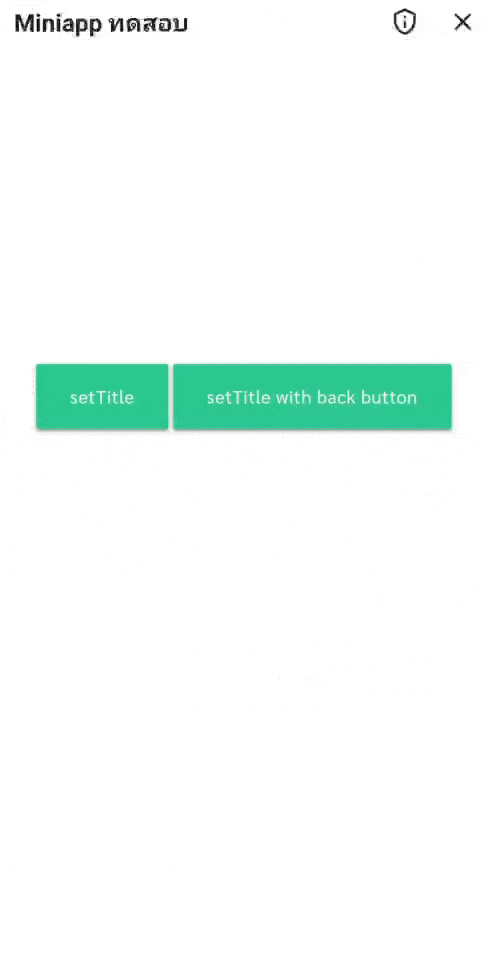
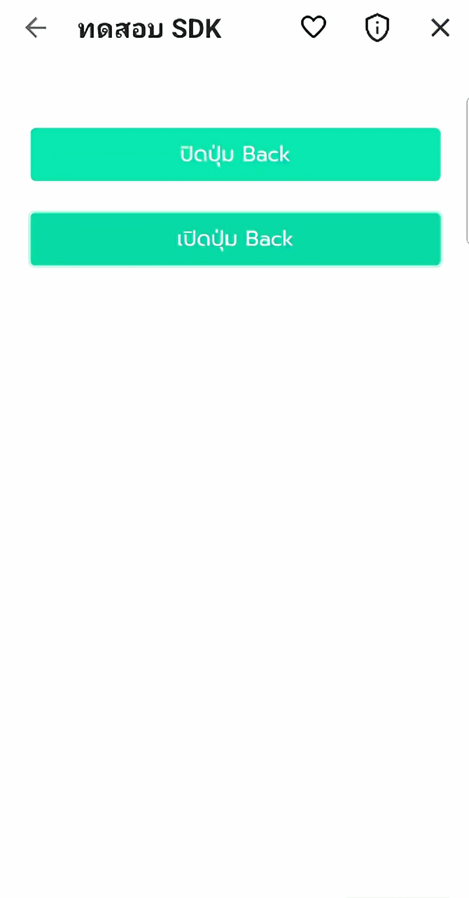
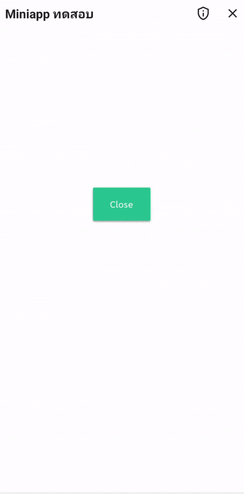

# Javascript SDK
ทางรัฐมี Javascript SDK ที่ช่วยอำนวยความสะดวกนักพัฒนา ให้สามารถเข้าถึงอุปกรณ์ และพัฒนาได้สะดวกมากยิ่งขึ้น โดยนักพัฒนาสามารถติดตั้ง Javascript SDK เพื่อเริ่มต้นใช้งานได้

```html
 <script src="https://czp.dga.or.th/cportal/sdk/iu/v3/sdk.js"></script>  
```  

### 1. Set Title
เปลี่ยนชื่อ Title ของแต่ละหน้า โดยรองรับการส่ง isShowBackButton (boolean) เพื่อตั้งค่าการแสดงผลปุ่ม back 
<!-- tabs:start -->
#### **Code**
```javascript
window.czpSdk.setTitle("Title Name",true);
window.czpSdk.setTitle("Title Name",false);
```
#### **Preview**



<!-- tabs:end -->

### 2. Set Back Button
ตั้งค่าการแสดงผลปุ่ม Back ของแต่ละหน้า โดยรองรับการส่ง setBackButtonVisible (boolean) เพื่อตั้งค่าการแสดงผลปุ่ม back 
<!-- tabs:start -->
#### **Code**
```javascript
window.czpSdk.setBackButtonVisible(true);
window.czpSdk.setBackButtonVisible(false);
```
#### **Preview**



<!-- tabs:end -->


### 3. Get Token
การเรียกข้อมูล MToken เพื่อใช้ในการเข้าถึงข้อมูล
<!-- tabs:start -->
#### **Code**
```javascript
window.czpSdk.getToken()
```
#### **Response**
```javascipt
"00000000-0000-0000-0000-000000000000"
```
<!-- tabs:end -->


### 4. Get Application Id
การเรียกข้อมูล Application ID ของ Mini App เพื่อใช้เป็นข้อมูลเข้าใช้งาน Mini App
<!-- tabs:start -->
#### **Code**
```javascript
window.czpSdk.getAppId()
```
#### **Response**
```javascipt
"00000000-0000-0000-0000-000000000000"
```
<!-- tabs:end -->

### 5. Save File with name
ฟังก์ชันการบันทึกไฟล์ รูปภาพหรือเอกสาร PDF โดยส่งข้อมูลให้กับทาง Mobile ในรูปแบบ Base64 โดยสามารถระบุชื่อไฟล์ได้ และรองรับข้อมูลตาม tab Data format  
==* ไม่ต้องระบุ base64 prefix==  
==* ชื่อไฟล์ต้องระบุ extension ด้วย==

<!-- tabs:start -->
#### **Code**
```javascript
window.czpSdk.sendFileToNativeWithName("/9j/4QAYRXhpZgAASUkqAAgAAAAAAAAAAAAAAP/sABFEdWNreQABAAQAAABkAAD/l6eddOk.....","doc.pdf")
```

#### **Data Format**
| | Name |  File Extension | Remark |
| --- | --------- | --------- | --------- | 
| 1. | JPEG | .jpeg | แนะนำขนาดภาพกว้าง 900 px
| 2. | PNG | .png | แนะนำขนาดภาพกว้าง 900 px
| 3. | WEBP | .webp | แนะนำขนาดภาพกว้าง 900 px
| 4. | ไฟล์ PDF | .pdf | ไฟล์ PDF
| 5. | ไฟล์ DOCX | .docx | ไฟล์ Word
| 6. | ไฟล์ DOC | .doc | ไฟล์ Word
| 8. | ไฟล์ XLSX | .xlsx | ไฟล์ Excel
| 9. | ไฟล์ XLS | .xls | ไฟล์ Excel
| 10. | ไฟล์ PPTX | .pptx | ไฟล์ Power Point
| 11. | ไฟล์ PPT | .ppt | ไฟล์ Power Point
<!-- tabs:end -->


### 6. Save File with url  
ฟังก์ชันการบันทึกไฟล์ รูปภาพหรือเอกสาร PDF โดยส่งข้อมูลให้กับทาง Mobile ในรูปแบบ Base64 โดยสามารถระบุชื่อไฟล์ได้ และรองรับข้อมูลตาม tab Data format

<!-- tabs:start -->
#### **Code**
```javascript
window.czpSdk.sendFileToNativeWithUrl("https://storage.googleapis.com/miniapps/images/icons/miniapp/ic_dga_czp-logo.png","logo.png")
```

#### **Data Format**
| | Name |  File Extension | Remark |
| --- | --------- | --------- | --------- | 
| 1. | JPEG | .jpeg | แนะนำขนาดภาพกว้าง 900 px
| 2. | PNG | .png | แนะนำขนาดภาพกว้าง 900 px
| 3. | WEBP | .webp | แนะนำขนาดภาพกว้าง 900 px
| 4. | ไฟล์ PDF | .pdf | ไฟล์ PDF
| 5. | ไฟล์ DOCX | .docx | ไฟล์ Word
| 6. | ไฟล์ DOC | .doc | ไฟล์ Word
| 8. | ไฟล์ XLSX | .xlsx | ไฟล์ Excel
| 9. | ไฟล์ XLS | .xls | ไฟล์ Excel
| 10. | ไฟล์ PPTX | .pptx | ไฟล์ Power Point
| 11. | ไฟล์ PPT | .ppt | ไฟล์ Power Point
<!-- tabs:end -->

### 7. Close Window
เรียกใช้เพื่อทำการปิด Mini App
<!-- tabs:start -->
#### **Code**
```javascript
window.czpSdk.closeWindow()
```
#### **Preview**


<!-- tabs:end -->


### 8. Scan Qr Code
เรียกใช้เพื่อต้องการให้ Mini App ใช้งาน QR Code เพื่อสแกนและได้รับผลลัพธ์ result ในรูปแบบ string
<!-- tabs:start -->
#### **Code**
```javascript
window.czpSdk.scanQrCode().then(result => alert(result));
```
#### **Preview**

<!-- tabs:end -->


### 9. Is CitizenPortal
ใช้เพื่อตรวจสอบว่า Mini App กำลังถูกเปิดผ่านแอปฯ ทางรัฐใช่หรือไม่
<!-- tabs:start -->
#### **Code**
```javascript
window.czpSdk.isCitizenPortal();
```
#### **Response**
```javascript
true
```
<!-- tabs:end -->


