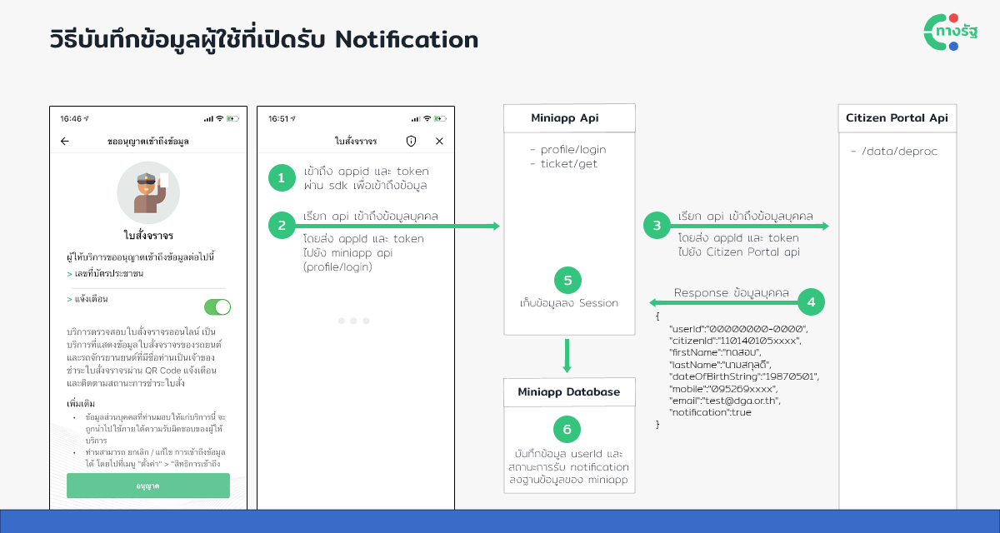
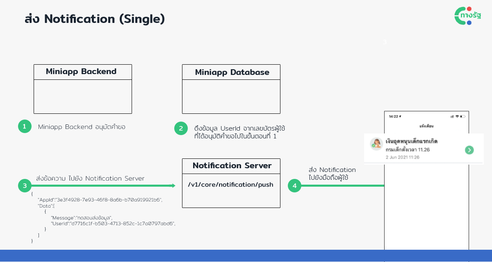
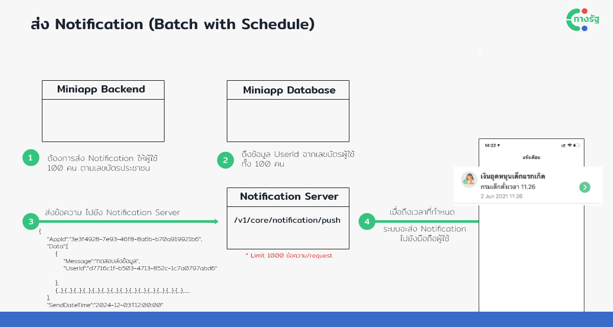

# Notification
แอปฯ ทางรัฐ ได้เปิดให้ Mini App สามารถส่ง Notification มาหาผู้ใช้ในนามของทางรัฐได้ผ่าน API ที่เปิดให้ใช้งาน ในการพัฒนา Notification Services จะแยกกระบวนการทำงานออกเป็น 2 ส่วนดังนี้
1. บันทึก UserID และสถานะการเปิดรับ Notification
2. การแจ้ง Notification

## ส่วนที่ 1 บันทึกข้อมูลผู้ใช้ที่เปิดรับ Notification



โดยจะเห็นว่าการเรียก Notification จำเป็นต้องเข้าถึง UserID ของผู้ใช้งานให้ได้ก่อน โดยการเข้าถึง UserID ในขั้นตอนที่ 4 และบันทึกข้อมูล UserID ดังกล่าวลงฐานข้อมูลของ Mini App ไว้ โดยสามารถดูรายละเอียดการใช้งาน API `shield/data/deproc` ได้ที่ [Access Sensitive data](/page/sensitivedata.md "Access Sensitive data") 

## ส่วนที่ 2 การแจ้ง Notification
หลังจากที่บันทึก UserID ของผู้ใช้ไว้ในระบบแล้ว เวลาต้องการส่ง Notification ก็เพียงเรียก API ตาม Specification ด้านล่าง โดยปกติแล้วมักมี Usecase ในการใช้งาน 2 แบบคือการส่งแบบเป็นรายคน หรือส่งเป็นกลุ่ม ซึ่งทั้งสองกรณี Notification API รองรับการส่งแบบตั้งเวลา






### Send Notification

สามารถส่งการแจ้งเตือน (Notification) ไปยังมือถือ iOS และ Android ได้ผ่านทางแอปฯ ทางรัฐ และ API นี้สามารถตั้งเวลารายการแจ้งเตือนได้ โดยสามารถดูได้ที่ Description ของ sendDateTime

<!-- tabs:start -->
#### **Request Url**
```api
POST https://api.egov.go.th/ws/dga/czp/uat/v1/core/notification/push
```

<!-- tabs:end -->

<!-- tabs:start -->
#### **Header**
```js
Consumer-Key: {{Consumer-Key}}
Content-Type: application/json
Token: {{Token}}
```
#### **Description**

| | Name | Type | Description | Required |
| --- | ------------ | --- | ------------ | --- |
| 1. | Consumer-Key | String | ได้จากการลงทะเบียน 	 | Required |
| 2. | Content-Type | String | Application/json	 	 | Required |
| 3. | Token | String | ได้จากการเรียก API Get Token	 	 | Required |

<!-- tabs:end -->


<!-- tabs:start -->
#### **Request**
```js
{
  "appId": "{{appId}}",
  "data": [
    {
      "message": "{{message}}",
      "userId": "{{userId}}"
    }
  ],
  "sendDateTime": "{{sendDateTime}}"
}
```
#### **Description**

| | Name | Type | Description | Required |
| --- | ------------ | --- | ------------ | --- |
| 1. | appId | String | Application Id	 | Required |
| 2. | message | String | ข้อความที่ต้องการส่ง เช่น คุณมีใบสั่งใหม่ของรถทะเบียน กข 1234 กรุงเทพมหานคร 	 | Required |
| 3. | userId | String | ได้จากการเรียก API shield/data/deproc ดูรายละเอียดเพิ่มเติมได้ที่ [Access Sensitive data](/page/sensitivedata.md "Access Sensitive data") 	 | Required |
| 4. | sendDateTime | DateTime | ในการตั้งเวลาต้องระบุเวลาเป็นปี คศ โดยสามารถส่งได้ใน format `YYYY-MM-DDTHH:MM:00+07:00` เช่น `2021-06-01T19:48:00+07:00` <br> หากไม่ส่งค่า sendDateTime หรือกำหนด sendDateTime เป็น null จะเป็นการส่ง Notification แบบทันที | Optional |
<!-- tabs:end -->

<!-- tabs:start -->
#### **Response**
**200: OK**
Stats successfully retrieved.
```js
{
  "result": [
    "c401e530-2200-4667-97a7-9aa253ae374a",
    "2389dcdb-be67-47dc-b8b7-c1185654d41c"
  ],
  "requestTimeStamp": 1593146034,
  "messageCode": 200,
  "message": null
}
```
#### **Description**

| | Name | Type | Description | 
| --- | ------------ | --- | ------------ | 
| 1. | result | Array String | TransactionID สำหรับใช้ตรวจสอบสถานะการส่ง Notification   ==*กรณีได้รับ messageCode = 200 แล้ว แต่ได้ result เป็น empty array แสดงว่าไม่มี user ที่ทำการ subscribe ระบบจึงไม่มีการส่ง noti==| 
| 2. | requestTimeStamp | Long | เวลาที่ตอบข้อมูลกลับมา (UTC) | 
| 3. | messageCode | Integer | Message Code (200 = Succeed)	 | 
| 4. | message | String | ข้อความสถานะ	 | 

<!-- tabs:end -->


