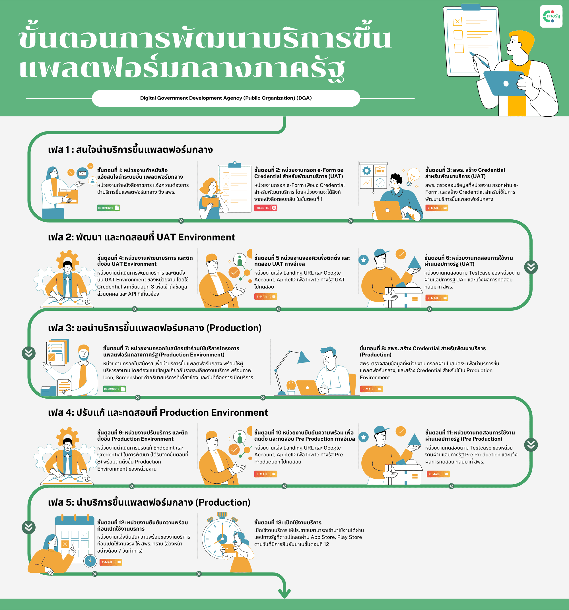

# ขั้นตอนการพัฒนาบริการขึ้นแพลตฟอร์มกลางของงานบริการภาครัฐสำหรับภาคธุรกิจและประชาชน (แพลตฟอร์มกลางฯ) (แอปฯ ทางรัฐ)
ในกระบวนการพัฒนาบริการ (Miniapp) เพื่อติดตั้งในแพลตฟอร์มกลางของงานบริการภาครัฐสำหรับภาคธุรกิจและประชาชน (แอปฯ ทางรัฐ) ตัวบริการจะต้องถูกพัฒนาขึ้นด้วย Web Application และติดตั้งขึ้นไปยัง Server ของหน่วยงานเอง โดยแอปฯ ทางรัฐ ได้มีการออกแบบวิธีการเข้าถึงข้อมูลให้มีความปลอดภัย และกำหนดแนวทางในการพัฒนา เพื่อให้รูปแบบของแต่ละบริการมีหน้าตาใกล้เคียงและสอดคล้องกัน โดยในกระบวนการพัฒนาบริการขึ้นแพลตฟอร์มกลางของงานบริการภาครัฐสำหรับภาคธุรกิจและประชาชน (แอปฯ ทางรัฐ) จะมีทั้งหมด 5 เฟส 13 ขั้นตอน หากหน่วยงานต้องการนำบริการขึ้นแพลตฟอร์มกลางฯ สามารถดำเนินการตามขั้นตอนต่อไปนี้ได้

### เฟส 1 : สนใจนำบริการขึ้นแพลตฟอร์มกลางของงานบริการภาครัฐสำหรับภาคธุรกิจและประชาชน (แอปฯ ทางรัฐ) 
#### ขั้นตอนที่ 1: หน่วยงานทำหนังสือ แจ้งสนใจนำระบบขึ้นแพลตฟอร์มกลางของงานบริการภาครัฐสำหรับภาคธุรกิจและประชาชน 
หน่วยงานทำหนังสือราชการ แจ้งสนใจนำบริการขึ้นแพลตฟอร์มกลางฯ ถึง สพร.  
โดยสามารถส่งหนังสือมาที่ saraban@dga.or.th

<strong>เอกสารที่เกี่ยวข้อง</strong>
- <a href="./_media/documents/process/AF1-1-document.pdf" target="_blank">ตัวอย่างหนังสือราชการ แจ้งสนใจนำบริการขึ้นแพลตฟอร์มกลาง</a>

#### ขั้นตอนที่ 2: หน่วยงานกรอก e-Form ขอ Credential สำหรับพัฒนาบริการ (UAT)
หน่วยงานกรอก e-Form เพื่อขอ Credential สำหรับพัฒนาบริการขึ้นแพลตฟอร์มกลางฯ ใน UAT Environment  
โดยหน่วยงานจะได้รับช่องทางการกรอกข้อมูลในหนังสือตอบกลับจาก สพร. ภายใน 14 วันทำการ นับจากวันที่ สพร. ได้รับเอกสารในขั้นตอนที่ 1

#### ขั้นตอนที่ 3: สพร. สร้าง Credential สำหรับพัฒนาบริการ (UAT)
สพร. ตรวจสอบข้อมูลที่หน่วยงาน กรอกผ่าน e-Form และสร้าง Credential สำหรับใช้ในการพัฒนาบริการขึ้นแพลตฟอร์มกลางฯ  
โดย สพร.จะดำเนินการสร้าง Credential ที่เกี่ยวข้องและแจ้งผลทางอีเมลภายใน 7 วันทำการ นับจากวันที่ได้รับข้อมูลจาก e-Form ในขั้นตอนที่ 2  
ทั้งนี้ หากหน่วยงานต้องการใช้งานทางรัฐ UAT สามารถขอ Invite ทางรัฐ UAT ไปทดสอบใน UAT Environment ได้  

### เฟส 2: พัฒนา และทดสอบที่ UAT Environment
#### ขั้นตอนที่ 4: หน่วยงานพัฒนาบริการ และติดตั้งขึ้น UAT Environment
หน่วยงานดำเนินการพัฒนาบริการ และติดตั้งบน UAT Environment ของหน่วยงาน 
โดยในกระบวนการพัฒนาจะต้องใช้ Credential จากขั้นตอนที่ 3 เพื่อเข้าถึงข้อมูลส่วนบุคคล และ API ที่เกี่ยวข้อง  
<strong>เอกสารที่เกี่ยวข้อง</strong>
- [วิธีเข้าถึงข้อมูลส่วนบุคคล และ API ที่เกี่ยวข้อง](/page/development.md)

#### ขั้นตอนที่ 5 หน่วยงานจองคิวเพื่อติดตั้ง และทดสอบ UAT ทางอีเมล
หน่วยงานแจ้ง Landing URL และ Google Account, AppleID เพื่อ Invite ทางรัฐ UAT ไปทดสอบ  
โดยหน่วยงานสามารถแจ้ง Landing URL และ Account ที่ต้องการใช้งานทางรัฐ UAT ทางอีเมล citizen.platform@dga.or.th    
ทั้งนี้ สพร. จะดำเนินการในส่วนที่เกี่ยวข้องและแจ้งผลทางอีเมล ภายใน 7 วันทำการ นับจากวันที่ สพร. ได้รับอีเมลจากหน่วยงาน
<strong>เอกสารที่เกี่ยวข้อง</strong>
- [วิธีใช้งานทางรัฐตัวทดสอบ](/page/tutorials.md)

#### ขั้นตอนที่ 6: หน่วยงานทดสอบการใช้งาน ผ่านแอปฯ ทางรัฐ (UAT)
หน่วยงานดำเนินการทดสอบตาม Testcase ของหน่วยงานผ่านแอปฯ ทางรัฐ UAT  
เมื่อทำการทดสอบเสร็จแล้ว ให้แจ้งทาง สพร.กลับมา พร้อมแนบเอกสารผลการทดสอบ ทางอีเมล citizen.platform@dga.or.th  
โดยแนะนำให้มีการทดสอบขั้นต่ำตาม Minimum Testcase ที่ สพร. กำหนดไว้เป็นอย่างน้อย  
ทั้งนี้ หน่วยงานจะต้องจัดเตรียมข้อมูลเกี่ยวกับรายละเอียดงานบริการ เช่น ไอคอนบริการ, Screenshot, คำอธิบายบริการแบบย่อ (ไม่เกิน 140 ตัวอักษร) และคำอธิบายบริการแบบเต็ม  

<strong>เอกสารที่เกี่ยวข้อง</strong>
- <a href="./_media/documents/process/AF6-1 Minimum testcase (uat).xlsx" target="_blank">Minimum Testcase ในการทดสอบบริการ (uat)</a>

### เฟส 3: ขอนำบริการขึ้นแพลตฟอร์มกลางดิจิทัลภาครัฐ  (Production)
#### ขั้นตอนที่ 7: หน่วยงานกรอกใบสมัครเข้าร่วมใช้บริการโครงการแพลตฟอร์มกลางภาครัฐ (Production Environment)
เมื่อหน่วยงานทดสอบการใช้งานผ่านแอปฯ ทางรัฐ UAT เรียบร้อยแล้ว และต้องการเข้าสู่ขั้นตอนการพัฒนาบริการขึ้น Production Environment  
หน่วยงานสามารถดาวน์โหลดใบสมัครฯ เพื่อดำเนินการกรอกข้อมูลต่างๆ พร้อมให้ผู้บริหารลงนาม โดยต้องแนบข้อมูลเกี่ยวกับรายละเอียดงานบริการ พร้อมภาพ Icon, Screenshot และคำอธิบายบริการที่เกี่ยวข้อง รวมถึงวันที่ต้องการเปิดให้บริการผ่านแอปฯ ทางรัฐ  
จากนั้นส่งใบสมัครฯ ดังกล่าวมาที่ saraban@dga.or.th

<strong>เอกสารที่เกี่ยวข้อง</strong>
- <a href="./_media/documents/process/AF3-7-Application.pdf" target="_blank">ใบสมัครเข้าร่วมใช้บริการโครงการแพลตฟอร์มกลางภาครัฐ</a>
- [รายละเอียดบริการ และภาพ Screenshot](/page/screenshot.md)

#### ขั้นตอนที่ 8: สพร. สร้าง Credential สำหรับพัฒนาบริการ (Production)
สพร. ตรวจสอบข้อมูลที่หน่วยงาน กรอกผ่านใบสมัครฯ เพื่อนำบริการขึ้นแพลตฟอร์มกลางฯ และสร้าง Credential สำหรับใช้ใน Production Environment 
โดย สพร.จะดำเนินการสร้าง Credential ที่เกี่ยวข้องและแจ้งผลทางอีเมลภายใน 14 วันทำการ นับจากวันที่ สพร. ได้รับข้อมูลใบสมัครฯ ในขั้นตอนที่ 7
ทั้งนี้ หากหน่วยงานต้องการใช้งานทางรัฐ Pre Production สามารถขอ Invite ทางรัฐ Pre Production ไปทดสอบใน Pre Production Environment ได้  

### เฟส 4: ปรับแก้ และทดสอบที่ Production Environment
#### ขั้นตอนที่ 9: หน่วยงานปรับบริการ และติดตั้งขึ้น Production Environment
หน่วยงานดำเนินการพัฒนาบริการ และติดตั้งบน Production Environment ของหน่วยงาน 
โดยในกระบวนการพัฒนาจะต้องใช้ Credential จากขั้นตอนที่ 8 เพื่อเข้าถึงข้อมูลส่วนบุคคล และ API ที่เกี่ยวข้อง  
โดยขั้นตอนนี้จำเป็นจะต้องมีการแก้ไข Endpoint และ Credential สำหรับพัฒนา เพื่อใช้งานกับ Production Environment

<strong>เอกสารที่เกี่ยวข้อง</strong>
- [วิธีเข้าถึงข้อมูลส่วนบุคคล และ API ที่เกี่ยวข้อง](/page/development.md)

#### ขั้นตอนที่ 10 หน่วยงานยืนยันความพร้อม เพื่อติดตั้ง และทดสอบ Pre Production ทางอีเมล
หน่วยงานแจ้ง Landing URL และ Google Account, AppleID เพื่อ Invite ทางรัฐ Pre Production ไปทดสอบ  
โดยหน่วยงานสามารถแจ้ง Landing URL และ Account ที่ต้องการใช้งานทางรัฐ Pre Production ทางอีเมล citizen.platform@dga.or.th  
ทั้งนี้ สพร. จะดำเนินการในส่วนที่เกี่ยวข้องและแจ้งผลทางอีเมล ภายใน 7 วันทำการ นับจากวันที่ สพร. ได้รับอีเมลจากหน่วยงาน

<strong>เอกสารที่เกี่ยวข้อง</strong>
- [วิธีใช้งานทางรัฐตัวทดสอบ](/page/tutorials.md)

#### ขั้นตอนที่ 11: หน่วยงานทดสอบการใช้งาน ผ่านแอปทางรัฐ (Pre Production)
หน่วยงานดำเนินการทดสอบตาม Testcase ของหน่วยงานผ่านแอปทางรัฐ Pre Production  
เมื่อทำการทดสอบเสร็จแล้ว ให้แจ้งทาง สพร.กลับมา พร้อมแนบเอกสารผลการทดสอบ ทางอีเมล citizen.platform@dga.or.th  
โดยแนะนำให้มีการทดสอบขั้นต่ำตาม Minimum Testcase ที่ สพร. กำหนดไว้เป็นอย่างน้อย  

<strong>เอกสารที่เกี่ยวข้อง</strong>
- <a href="./_media/documents/process/AF11-1 Minimum testcase (pre-prod).xlsx" target="_blank">Minimum Testcase ในการทดสอบบริการ (pre-production)</a>

### เฟส 5: นำบริการขึ้นแพลตฟอร์มกลางดิจิทัลภาครัฐ (Production)
#### ขั้นตอนที่ 12 : หน่วยงานยืนยันความพร้อมก่อนเปิดใช้งานบริการ
หน่วยงานแจ้งยืนยันความพร้อมของงานบริการก่อนเปิดใช้งานจริง ให้ สพร. ทราบ (ล่วงหน้าอย่างน้อย 7 วันทำการ) ทางอีเมล <a href="mailto:citizen.platform@dga.or.th" target="_blank">citizen.platform@dga.or.th</a>

#### ขั้นตอนที่ 13 : เปิดใช้งานบริการ
สพร. เปิดใช้งานบริการ ให้ประชาชนสามารถเข้ามาใช้งานได้ผ่านแอปทางรัฐที่ดาวน์โหลดผ่าน App Store, Play Store