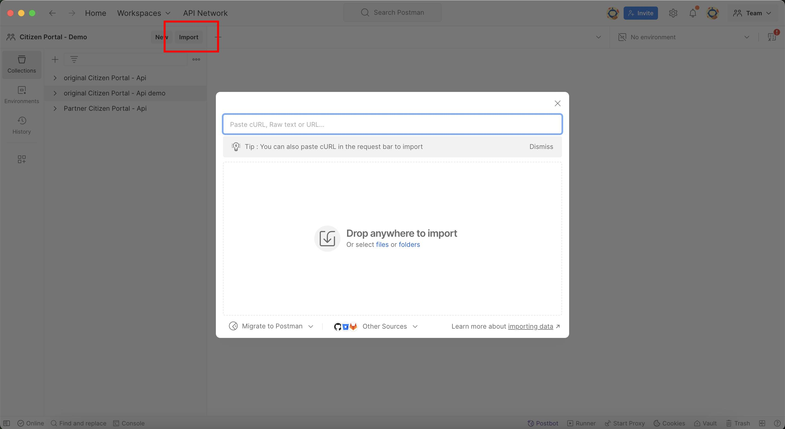
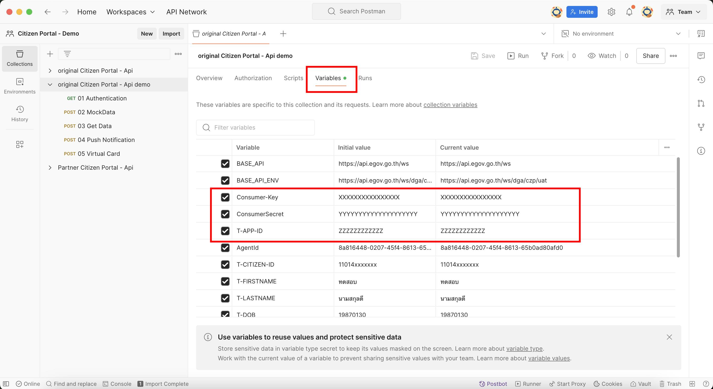
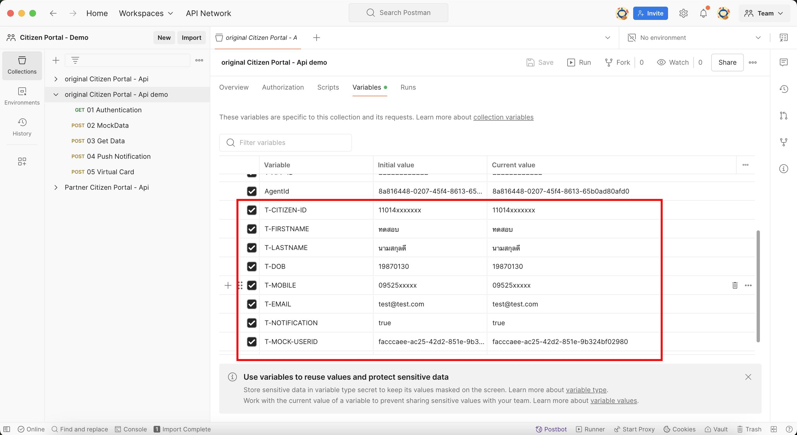
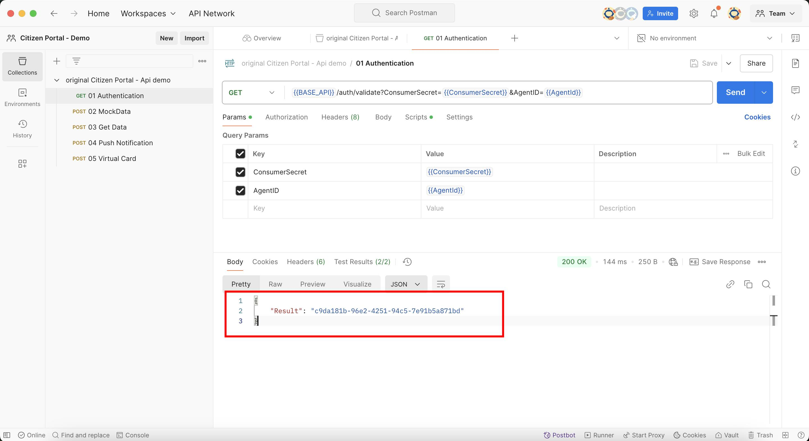
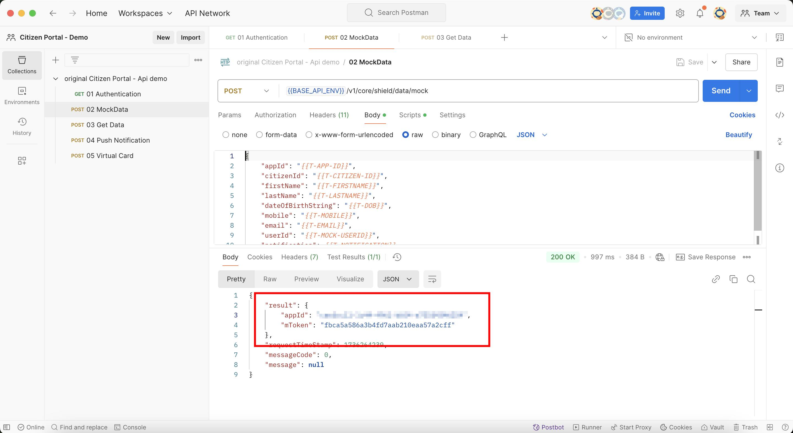
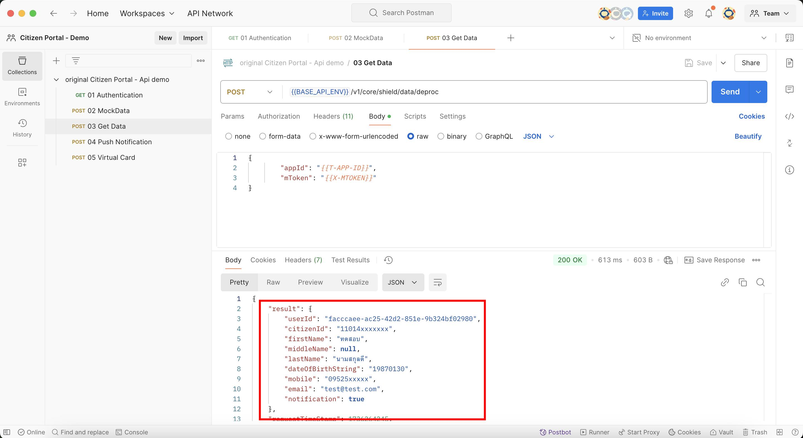

# วิธีใช้งาน postman
ในการพัฒนาบริการ ที่ต้องการเข้าถึง API ของทางรัฐ คุณสามารถเริ่มต้นได้โดยใช้ Postman ตัวอย่างนี้ โดยจะมีขั้นตอนในการใช้งาน ดังนี้

### Prerequisite
ในการเรียก API ของทางรัฐ คุณจำเป็นต้องมี Credential ที่ใช้ในการพัฒนาบริการก่อน โดยสามารถดูวิธีการขอ Credential ได้ที่ [ภาพรวมการพัฒนา](/page/overview.md "ภาพรวมการพัฒนา")

### ขั้นตอนการใช้งาน Postman
1. Download Postman ทางรัฐ Collection <a href="./_media/postman/20250101 - ทางรัฐ - postman.postman_collection.json.zip" target="_blank">ทางรัฐ Collection </a>
2. Import Collection เข้าไปใน Postman

3. อัปเดตข้อมูล Consumer-Key, ConsumerSecret และ AgentID ใน Variable  
โดย AgentID สามารถใช้เป็น Unique String ที่สร้างขึ้น อาจใช้เป็น SessionID หรือ User Identity ของผู้เรียกใช้ข้อมูล เช่น เลขบัตรประชาชน, userID

4. แก้ไขข้อมูลส่วนบุคคลใน Variable เพื่อใช้ร่วมกับ api 02 Mock data

5. เรียก API 01 Authentication เพื่อรับ Authorization Token

6. เรียก API 02 MockData เพื่อสร้าง mToken 

7. เรียก API 03 Get Data เพื่อเข้าถึงข้อมูลส่วนบุคคล

