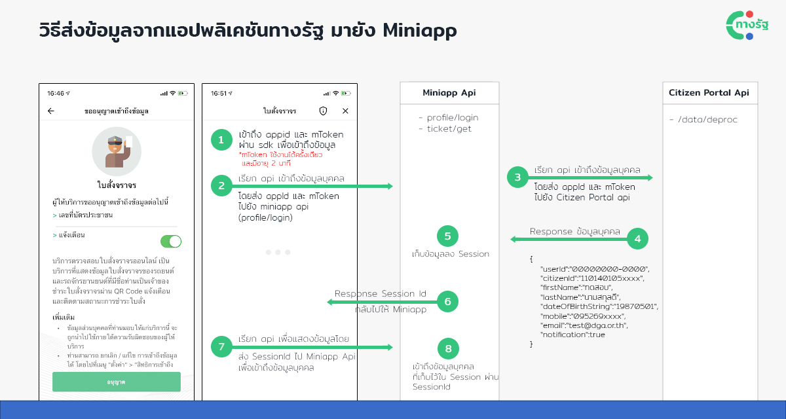

# การเข้าถึงข้อมูลส่วนบุคคล
ทางรัฐสามารถส่งข้อมูลส่วนบุคคลไปยัง Mini App ปลายทางได้ ซึ่งจะทำการส่งเมื่อผู้ใช้งานอนุญาตให้ Mini App ดังกล่าวเข้าถึงข้อมูลได้ และด้วยเหตุผลทางด้านความปลอดภัย ข้อมูลที่ถูกส่งไปให้ Mini App จะถูกเข้ารหัส และสามารถเข้าถึงได้เพียงครั้งเดียวต่อการเข้าใช้งาน จึงจำเป็นต้องมีการเข้าถึงข้อมูลด้วยกระบวนการดังต่อไปนี้


1. เข้าถึง  `AppID` และ `mToken` ผ่าน sdk `window.czpSdk.getAppId()` และ `window.czpSdk.getToken()`  
==* mToken สามารถใช้งานได้เพียงครั้งเดียว และมีอายุ 2 นาที==
2. เรียก API ที่ทาง Mini App พัฒนาขึ้นเพื่อ Login และดึงข้อมูลส่วนบุคคล
3. เรียก API shield/data/deproc (`https://api.egov.go.th/ws/dga/czp/uat/v1/core/shield/data/deproc`) เพื่อเข้าถึงข้อมูลบุคคล โดยรับ Parameter เป็น AppID และ mToken จากข้อ 1
4. API shield/data/deproc จะ Response ข้อมูลส่วนบุคคลกลับมา
5. ทำการบันทึกข้อมูลดังกล่าวลง Session
6. Mini App API จะส่ง Response SessionID กลับไปให้ Mini App
7. เมื่อมีการเรียก Mini App API อื่นๆ เพื่อเข้าถึงข้อมูล เช่น เข้าถึงข้อมูลใบสั่งของคนนั้นๆ จะทำการแนบ SessionID ไปด้วย
8. Mini App API จะดึงข้อมูลส่วนบุคคล ที่ถูกเก็บไว้ใน Session ผ่าน SessionID ที่แนบมา และเอาไปใช้ในการดึงข้อมูลที่เกี่ยวข้องต่อไป เช่น ดึงเลขบัตรประชาชนจาก Session และเอาเลขบัตรไปค้นหาข้อมูลใบสั่งในฐานข้อมูล


### Testing - Mock data
ในการทดสอบการใช้งาน Mini App ระบบจะเปิดให้สามารถเข้าถึง API ที่ใช้ในการ Mock up ข้อมูล  เพื่อให้สะดวกต่อการพัฒนาใน UAT Environment โดยมีขั้นตอนในการเรียก API ดังต่อไปนี้

<!-- tabs:start -->
#### **Request Url**
```api
POST https://api.egov.go.th/ws/dga/czp/uat/v1/core/shield/data/mock
```
<!-- tabs:end -->

<!-- tabs:start -->
#### **Header**
```js
Consumer-Key: {{Consumer-Key}}
Content-Type: application/json
Token: {{Token}}
```
#### **Description**

| | Name | Type | Description | Required |
| --- | ------------ | --- | ------------ | --- |
| 1. | Consumer-Key | String | ได้จากการลงทะเบียน 	 | Required |
| 2. | Content-Type | String | Application/json	 	 | Required |
| 3. | Token | String | ได้จากการเรียก API Get Token	 	 | Required |

<!-- tabs:end -->

<!-- tabs:start -->
#### **Request**
```js
{
    "AppId":"{{AppId}}",
    "CitizenId":"{{CitizenId}}",
    "FirstName":"{{FirstName}}",
    "LastName":"{{LastName}}",
    "DateOfBirthString":"{{DateOfBirthString}}",
    "Mobile":"{{Mobile}}",
    "Email":"{{Email}}",
    "Notification":true    
}
```
#### **Description**

| | Name | Type | Description | Required | &nbsp;&nbsp;&nbsp;&nbsp; | หมายเหตุ |
| --- | ------------ | --- | ------------ | ---------- | | -------- |
| 1. | AppId | String | Mini App ID	 | Required |  |  |
| 2. | CitizenId | String | เลขบัตรประชาชน | Optional |   |  |
| 3. | FirstName | String | ชื่อ | Optional |   |  |
| 4. | LastName | String | นามสกุล | Optional |   |  |
| 5. | DateOfBirthString | String | วันเกิด | Optional |  | ข้อมูลส่งเป็นปี ค.ศ. หากไม่ระบุข้อมูลบางอย่าง จะแสดงผลด้วย `-` ในรูปแบบดังต่อไปนี้  `yyyyMMdd`, `yyyyMM--`, `yyyy----` เช่น `19870501`,  |
| 6. | Mobile | String | เบอร์โทรศัพท์ | Optional |   |  |
| 7. | Email | String | อีเมล | Optional |   |  |
| 8. | Notification | Boolean | สถานะการรับ Notification | Optional |  | ผู้ใช้จะได้รับข้อความเข้า inbox ทุกกรณี ไม่ว่าจะตั้งค่าการรับแจ้งเตือน (Notification) เป็น true หรือ false  |

<!-- tabs:end -->


<!-- tabs:start -->
#### **Response**
**200: OK**
Stats successfully retrieved.
```js
{
    "result": {
        "appId": "bfcfe3f4-6663-4159-a21a-045ea90b98ee",
        "mToken": "3a5bbe51-b3a5-4761-b326-c8c158251a99",
    },
    "requestTimeStamp": 1638874163,
    "messageCode": 0,
    "message": null
}
```
#### **Description**

| | Name | Type | Description | 
| --- | ------------ | --- | ------------ | 
| 1. | appId | String | Mini App ID	 | 
| 2. | mToken | String | Token ที่จะใช้ในการเข้าถึงข้อมูล | 
| 3. | requestTimeStamp | Long | เวลาที่ตอบข้อมูลกลับมา (UTC) | 
| 4. | messageCode | Integer | Message Code (200 = Succeed)	 | 
| 5. | message | String | ข้อความสถานะ	 | 

<!-- tabs:end -->


### Testing - Get data
0. เมื่อได้ `appId` และ `mToken` ตามขั้นตอนก่อนหน้าแล้ว ผู้พัฒนาต้องนำ ข้อมูลดังกล่าวมาประกอบเป็น URL เพื่อเปิดไปยังหน้า Landing Page ดังนี้

```html
http://localhost:3000/landing?appId=bfcfe3f4-6663-4159-a21a-045ea90b98ee&mToken=3a5bbe51-b3a5-4761-b326-c8c158251a99
```

1. Mini App เข้าถึง `appId` และ `mToken` ผ่าน sdk `window.czpSdk.getAppId()` และ `window.czpSdk.getToken()`

```js
window.czpSdk.ntResponse('{ "data": { "CitizenId": "1101401xxxxxx","FirstName":"ทดสอบ","LastName":"นามสกุลดี","DateOfBirthString":"19870501","Mobile":"095000xxxx","Email":"test@dga.or.th" }, "config": [ { "key": "Notification", "value": true }, { "key": "Location", "value": true }, { "key": "Camera", "value": true } ], "accessToken":"00000000000000000000000000000000" }')
```

2. เรียก API ที่ทาง Mini App พัฒนาขึ้นเพื่อ Login และดึงข้อมูลส่วนบุคคล
3. เรียก API shield/data/deproc เพื่อเข้าถึงข้อมูลบุคคล โดยรับ Parameter เป็น AppID และ Token จากข้อ 1 โดยรายละเอียดการเรียก API มีขั้นตอนดังนี้

<!-- tabs:start -->
#### **Request Url**
```api
POST https://api.egov.go.th/ws/dga/czp/uat/v1/core/shield/data/deproc
```
<!-- tabs:end -->

<!-- tabs:start -->
#### **Header**
```js
Consumer-Key: {{Consumer-Key}}
Content-Type: application/json
Token: {{Token}}
```
#### **Description**

| | Name | Type | Description | Required |
| --- | ------------ | --- | ------------ | --- |
| 1. | Consumer-Key | String | ได้จากการลงทะเบียน 	 | Required |
| 2. | Content-Type | String | Application/json	 	 | Required |
| 3. | Token | String | ได้จากการเรียก API Get Token	 	 | Required |

<!-- tabs:end -->

<!-- tabs:start -->
#### **Request**
```js
{
    "AppId":"{{AppId}}",
    "MToken":"{{MToken}}",
}
```
#### **Description**

| | Name | Type | Description | Required |
| --- | ------------ | --- | ------------ | --- |
| 1. | AppId | String | Mini App ID	 | Required |
| 2. | MToken | String | Token ที่ได้จากขั้นตอนการ Mockup | Required |
<!-- tabs:end -->

<!-- tabs:start -->
#### **Response**
**200: OK**
Stats successfully retrieved.
```js
{
    "result": {
        "userId": "00000000-0000-0000-0000-000000000000",
        "citizenId": "1101401xxxxxx",
        "firstName": "ทดสอบ",
        "lastName": "นามสกุลดี",
        "dateOfBirthString": "19860501",
        "mobile": "026126001",
        "email": "test@dga.or.th",
        "notification": true
    },
    "requestTimeStamp": 1638874591,
    "messageCode": 200,
    "message": "Success"
}
```
#### **Description**

| | Name | Type | Description | หมายเหตุ|
| --- | ----------- | --- | ------------ | ------------ | 
| 1. | UserId | String | User ID ของผู้ใช้	 |  จะถูกนำไปใช้ในการส่ง Notification |
| 2. | CitizenId | String | เลขบัตรประชาชน |  |
| 3. | FirstName | String | ชื่อ |  |
| 4. | LastName | String | นามสกุล |  |
| 5. | DateOfBirthString | String | วันเกิด |  ข้อมูลส่งเป็นปี ค.ศ. หากไม่ระบุข้อมูลบางอย่าง จะแสดงผลด้วย `-` ในรูปแบบดังต่อไปนี้   `yyyyMMdd`, `yyyyMM--`,  `yyyy----` เช่น `19870501`,  |
| 6. | Mobile | String | เบอร์โทรศัพท์ |  |
| 7. | Email | String | อีเมล |  |
| 8. | Notification | Boolean | สถานะการรับ Notification  |  ผู้ใช้จะได้รับข้อความเข้า inbox ทุกกรณี ไม่ว่าจะตั้งค่าการรับแจ้งเตือน (Notification) เป็น true หรือ false |

<!-- tabs:end -->
