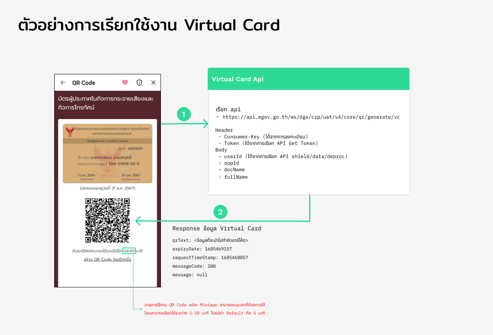

# Virtual Card

### การสร้างคิวอาร์โค้ด ใน Virtual Card
แอปฯ ทางรัฐ ได้เปิดให้ Mini App สามารถใช้งาน Virtual Card ผ่าน API ได้ดังนี้  
==* ผู้ใช้งานสามารถสร้าง QR Code ได้ 1 อันต่อ 1 Miniapp หากมีการสร้าง QR Code ใหม่ จะทำให้ QR Code เดิมใช้งานไม่ได้ทันที ==



<!-- tabs:start -->
#### **Request Url**
```api
POST https://api.egov.go.th/ws/dga/czp/uat/v4/core/qr/generate/vc
```

<!-- tabs:end -->


<!-- tabs:start -->
#### **Header**
```js
Consumer-Key: {{Consumer-Key}}
Content-Type: application/json
Token: {{Token}}
```
#### **Description**

| | Name | Type | Description | Required |
| --- | ------------ | --- | ------------ | --- |
| 1. | Consumer-Key | String | ได้จากการลงทะเบียน 	 | Required |
| 2. | Content-Type | String | Application/json	 	 | Required |
| 3. | Token | String |  ได้จากการเรียก API Get Token 	 | Required |

<!-- tabs:end -->

<!-- tabs:start -->
#### **Request**
```js
{
  "appId": "{{appId}}",
  "userId": "{{userId}}",
  "docName": "{{docName}}",
  "fullName": "{{fullName}}"
}
```
#### **Description**

| | Name | Type | Description | Required |
| --- | ------------ | --- | ------------ | --- |
| 1. | appId | String | Application Id	 | Required |
| 2. | userId | String | ได้จากการเรียก API shield/data/deproc ดูรายละเอียดเพิ่มเติมได้ที่ [Access Sensitive Data](/page/sensitivedata.md "Access Sensitive Data") | Required |
| 3. | docName | String | ข้อความของเอกสารหรือบัตรประจำตัว เช่น บัตรประจำตัวทหารระดับชั้นสัญญาบัตร | Required |
| 4. | fullName | String | ข้อความชื่อและนามสกุล | Required |
<!-- tabs:end -->

<!-- tabs:start -->
#### **Response**
**200: OK**
Stats successfully retrieved.
```js
{
  "result": {
      "qrText": "<ข้อมูลที่จะนำไปทำคิวอาร์โค้ด>",
      "expiryDate": 1685644619
  },
  "requestTimeStamp": 1685644319,
  "messageCode": 200,
  "message": null
}
```
#### **Description**

| | Name | Type | Description | 
| --- | ------------ | --- | ------------ | 
| 1. | qrText | String | ข้อมูลที่จะนำไปทำคิวอาร์โค้ด | 
| 2. | expiryDate | Long | เวลาหมดอายุของคิวอาร์โค้ด	(UTC) | 
| 3. | requestTimeStamp | Long | เวลาที่ตอบข้อมูลกลับมา (UTC) | 
| 4. | messageCode | Integer | Message Code (200 = Succeed)	 | 
| 5. | message | String | ข้อความสถานะ	 | 

<!-- tabs:end -->


